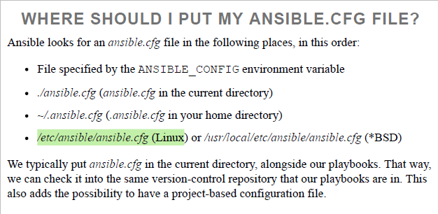

# Ansible-Learning
Ansible Learning  Welcome to the Ansible Learning repository! This repository is designed to help you get started with Ansible, a powerful IT automation tool. Here, you will find various playbooks, roles, and examples to guide you through the basics and advanced features of Ansible.

Ansible is an open-source automation tool used for configuration management, application deployment, and task automation. It uses a simple, easy-to-understand language (YAML) to describe automation jobs, making it accessible to a wide range of IT professionals.

What’s So Great About Ansible?
Easy-to-read syntax
Easy to audit
Agentless (works on SSH)
Top to bottom task
Powerful
Ansible is push-based by default. Making a change looks like
this:
1. You: make a change to a playbook.
2. You: run the new playbook.
3. Ansible: connects to servers and executes modules that change the
state of the servers.
As soon as you run the ansible-playbook command, Ansible
connects to the remote servers and does its thing; this lowers the risk of
random servers potentially breaking whenever their scheduled tasks fail to
change things successfully.

Assignments - 1

Questions for this assignment

Write the steps for setting up the Ansible Control Node.

What are all the Ansible components?

How to Configure Managed Hosts?

How to create an Ansible Inventory?

How to create an Ansible Playbooks?

How to execute Ansible Playbook? 

Answers:

1. Write the steps for setting up the Ansible Control Node.

To set up an Ansible Control Node, follow these steps:

    Install Ansible:
        On Ubuntu/Debian:

        bash

sudo apt update
sudo apt install ansible -y

On CentOS/RHEL:

bash

    sudo yum install epel-release -y
    sudo yum install ansible -y

Set Up SSH Access:

    Generate an SSH key pair:

    bash

ssh-keygen

Copy the SSH key to managed hosts:

bash

    ssh-copy-id user@managed_host

Verify Ansible Installation:

    Check the Ansible version:

    bash

    ansible --version

Create Inventory File:

    Create an inventory file (/etc/ansible/hosts or ~/ansible/hosts):

    ini

    [webservers]
    192.168.1.101
    192.168.1.102

Test Connectivity:

    Test connectivity to the managed hosts:

    bash

        ansible all -m ping

2. What are all the Ansible components?

Ansible has several key components:

    Inventory: A file that defines the hosts and groups of hosts that Ansible manages.
    Modules: Reusable, standalone scripts that Ansible runs on managed hosts (e.g., yum, apt, copy).
    Plugins: Extend Ansible’s core functionality, such as connection types or logging (e.g., callback plugins, action plugins).
    Playbooks: YAML files that define a series of tasks for Ansible to run on managed hosts.
    Roles: A way to organize playbooks and other files for easy sharing and reuse.
    Tasks: A single action to be executed (e.g., installing a package, copying a file).
    Handlers: Tasks that are triggered by the results of other tasks, usually to restart a service.
    Facts: System information gathered by Ansible about the managed hosts (e.g., IP address, OS type).

3. How to Configure Managed Hosts?

To configure managed hosts:

    Ensure SSH Access:
        Ansible uses SSH to communicate with managed hosts, so ensure SSH access is configured. Use the ssh-copy-id command to copy the SSH key to the managed hosts.

    Install Required Packages (if necessary):
        On some systems, you may need to install Python or other dependencies required by Ansible.

    Add Hosts to Inventory:
        Add the IP address or hostname of the managed hosts to your Ansible inventory file (/etc/ansible/hosts or ~/ansible/hosts).

    Configure SSH and Sudo:
        Ensure the user that Ansible uses has the necessary permissions (usually via sudo) on the managed hosts.

4. How to create an Ansible Inventory?

To create an Ansible inventory:

    Create an Inventory File:
        The inventory file is usually located at /etc/ansible/hosts or ~/ansible/hosts.

    Add Hosts and Groups:
        Define your hosts and organize them into groups:

        ini

    [webservers]
    192.168.1.101
    192.168.1.102

    [databases]
    192.168.1.201
    192.168.1.202

Specify Variables (Optional):

    You can define variables for groups or individual hosts:

    ini

        [webservers]
        192.168.1.101 ansible_user=admin ansible_password=secret
        192.168.1.102 ansible_user=admin ansible_password=secret

    Use Dynamic Inventory (Optional):
        If your environment is dynamic, you can use a dynamic inventory script that pulls inventory data from sources like AWS, Azure, etc.

5. How to create an Ansible Playbook?

To create an Ansible playbook:

    Create a YAML File:
        Create a .yml file to define your playbook:

        bash

    touch my_playbook.yml

Define the Playbook Structure:

    Start with basic playbook structure:

    yaml

        ---
        - name: Install and configure Apache
          hosts: webservers
          become: true

          tasks:
            - name: Install Apache
              yum:
                name: httpd
                state: present

            - name: Start Apache
              service:
                name: httpd
                state: started
                enabled: true

    Add Tasks:
        Add tasks under the tasks section to define the actions you want to perform.

    Include Handlers (Optional):
        If necessary, include handlers to trigger specific actions when a change occurs.

    Save the File:
        Save the file with a .yml or .yaml extension.

6. How to execute Ansible Playbook?

To execute an Ansible playbook:

    Run the Playbook:
        Use the ansible-playbook command followed by the playbook file name:

        bash

    ansible-playbook my_playbook.yml

Specify Inventory File (Optional):

    If your inventory file is not in the default location, specify it with the -i option:

    bash

    ansible-playbook -i /path/to/your/inventory my_playbook.yml

Use Additional Options (Optional):

    Use options like --check for a dry run or --limit to target specific hosts:

    bash

        ansible-playbook my_playbook.yml --check

These steps cover the basic setup and usage of Ansible from setting up a control node to running playbooks.
